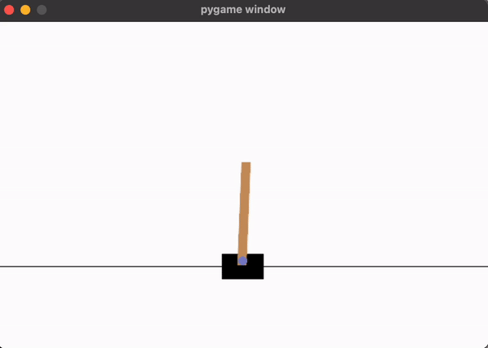
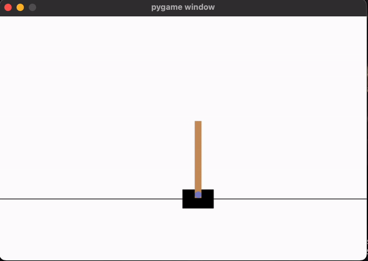
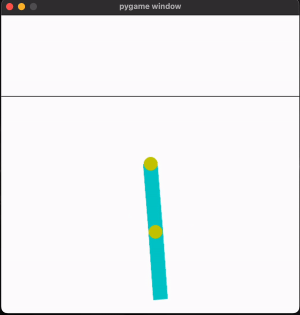
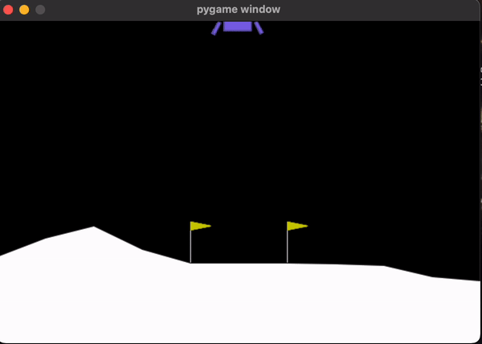
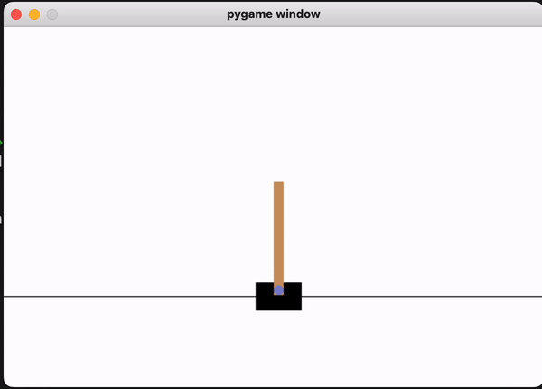
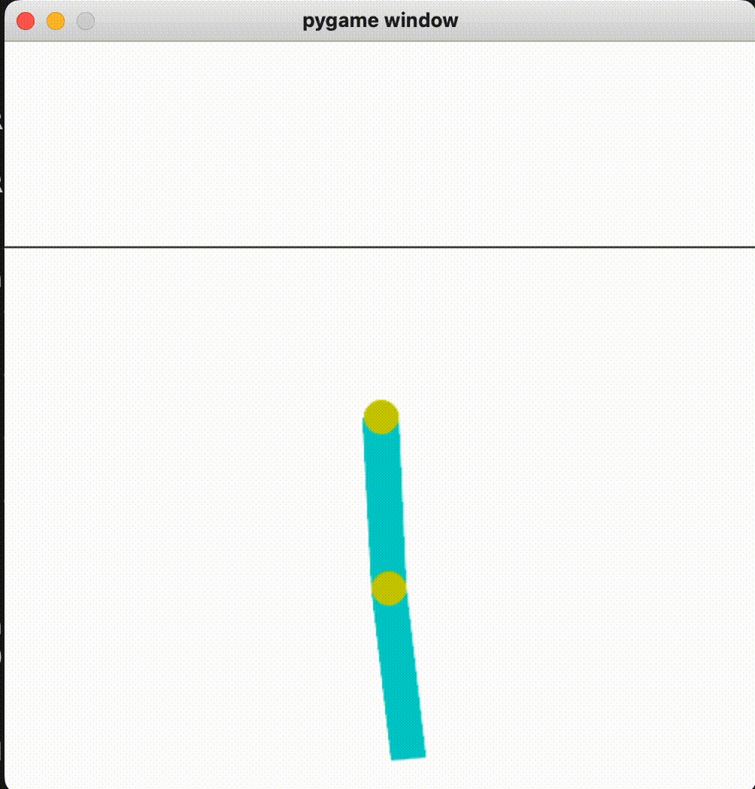
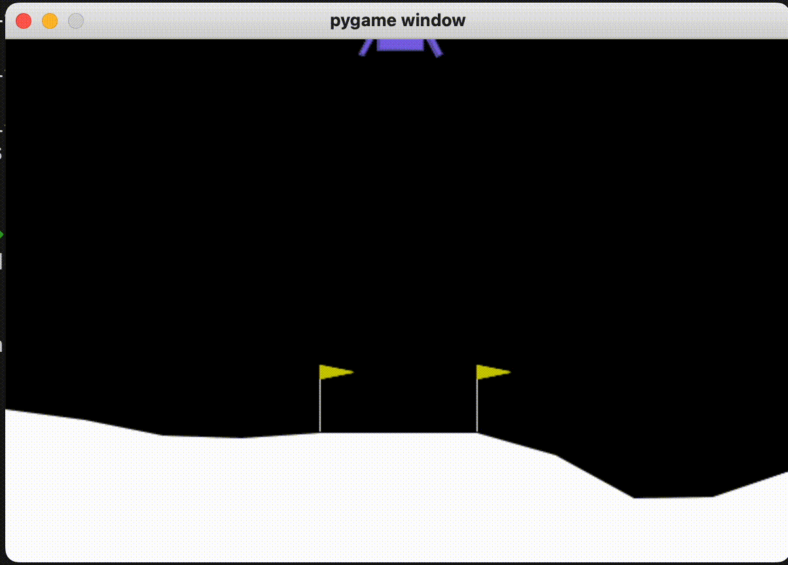

# rl-from-scratch

This project was done as a part of the cource project COMPSCI 687. We have implemented REINFORCE with baseline, Actor critic episodic method and PPO and have discussed and benchmarked the performance of these methods on environments provided by the Open AI gymnasium toolkit. We also implemented different variations of the PPO algorithm, like adding entropy bonus to facilitate exploration and normalizing advantage estimates for stability. Please refer to this [report](report.pdf) for more specific details.

## Setting up the environment :
For best results we recommend setting up a conda environment or a venv. To install the dependencies, run:

```pip install -r requirements.txt```

## Training and Visualizing the agent :

For training the agent using Reinforce with baseline, run : 

For Lunar Lander : 
```python reinforce.py```

For Cartpole : 
```python reinforce-cartpole.py```

For acrobot: 
```python reinforce-acrobot.py```

### Actor Critic

For training the agent using actor-critic, run :

```python actor_critic.py --env_name <env_name> --rand_seed <rand_seed>```

For visualizing the trained model using actor-critic, run (For running the models trained by us keep   `rand_seed` between 0-4) :

```python actor_critic.py --env_name <env_name> --rand_seed <rand_seed> --eval_only```

### PPO
For training the agent using ppo, run :

```python ppo.py --env_name <env_name> --rand_seed <rand_seed>```

For visualizing the trained model using ppo, run (For running the models trained by us keep `rand_seed` between 0-4) :

```python ppo.py --env_name <env_name> --rand_seed <rand_seed> --eval_only```

## Reinforce with baseline results : 

### Cartpole : 


### Acrobot : 


### Lunar lander : 


## Actor critic results : 

### Cartpole : 


### Acrobot : 


### Lunar lander : 



## Proximal policy optimization : 

### Cartpole : 


### Acrobot : 


### Lunar lander : 



